# MR 框架

[English](README_EN.md)

 ----------

<!-- TOC -->
* [MR 框架](#mr-框架)
* [简介](#简介)
* [关键特性](#关键特性)
* [主要组成](#主要组成)
* [标准化设备接口](#标准化设备接口)
* [配置工具](#配置工具)
* [目录结构](#目录结构)
* [设备/组件支持一览表](#设备组件支持一览表)
* [开始使用](#开始使用)
  * [配置 `Kconfig` 环境](#配置-kconfig-环境)
  * [将框架导入工程](#将框架导入工程)
  * [配置菜单选项](#配置菜单选项)
  * [生成配置文件](#生成配置文件)
  * [添加包含路径](#添加包含路径)
* [先来点个灯吧](#先来点个灯吧)
* [Hello World](#hello-world)
* [现在您已经完成了入门教程，开始使用MR库吧](#现在您已经完成了入门教程开始使用mr库吧)
<!-- TOC -->

 ----------

# 简介

`MR` 框架是专为嵌入式系统设计的轻量级框架。充分考虑了嵌入式系统在资源和性能方面的需求。
通过提供标准化的设备管理接口，极大简化了嵌入式应用开发的难度，帮助开发者快速构建嵌入式应用程序。

框架为开发者提供了标准化的开启(`open`)、关闭(`close`)、控制(`ioctl`)、读(`read`)、写(`write`)
等接口。它将应用程序与底层硬件驱动进行解耦。应用程序无需了解驱动的实现细节。
当硬件发生改变时,只需要适配底层驱动,应用程序就可以无缝迁移到新硬件上。这大大提高了软件的可重用性和应对新硬件的可扩展性。

 ----------

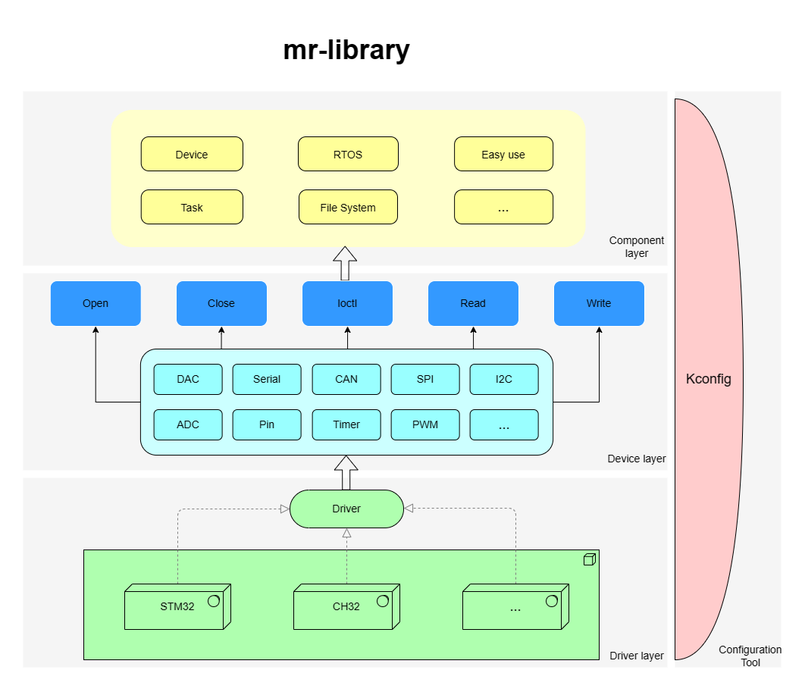

 ----------

# 关键特性

- 标准化的设备访问接口
- 应用程序和驱动开发解耦
- 简化底层驱动和应用程序开发
- 轻量易上手，资源占用低
- 模块化设计，各部分解耦合并独立开发，极低的硬件迁移成本
- 支持在裸机环境和操作系统环境下使用

# 主要组成

- 设备框架：提供设备访问标准接口
- 内存管理：动态内存管理
- 工具：链表、队列、平衡树等常用数据结构
- 各类功能组件

 ----------

# 标准化设备接口

设备的所有操作都可通过以下接口实现：

| 接口              | 描述      |
|:----------------|:--------|
| mr_dev_register | 注册设备    |
| mr_dev_open     | 打开设备    |
| mr_dev_close    | 关闭设备    |
| mr_dev_ioctl    | 控制设备    |
| mr_dev_read     | 从设备读取数据 |
| mr_dev_write    | 向设备写入数据 |

示例：

```c
struct mr_spi_dev spi_dev;

int main(void)
{
    /* 注册SPI10设备（CS低电平有效）到SPI1总线上 */
    mr_spi_dev_register(&spi_dev, "spi1/spi10", 0, MR_SPI_CS_ACTIVE_LOW);

    /* 打开SPI1总线下的SPI10设备 */
    int ds = mr_dev_open("spi1/spi10", MR_OFLAG_RDWR);
    
    /* 发送数据 */
    uint8_t wr_buf[] = {0x01, 0x02, 0x03, 0x04};
    mr_dev_write(ds, wr_buf, sizeof(wr_buf));
    
    /* 接收数据 */
    uint8_t rd_buf[4] = {0};
    mr_dev_read(ds, rd_buf, sizeof(rd_buf));
    
    /* 关闭设备 */
    mr_dev_close(ds);
}
```

 ----------

# 配置工具

`MR` 提供 `Kconfig` 可视化配置工具，开发者无需深入了解源代码即可进行配置。

`Kconfig` 会根据配置文件自动生成配置选项界面。开发者可以通过简单的操作来选择需要启用的功能组件和设置相关参数。

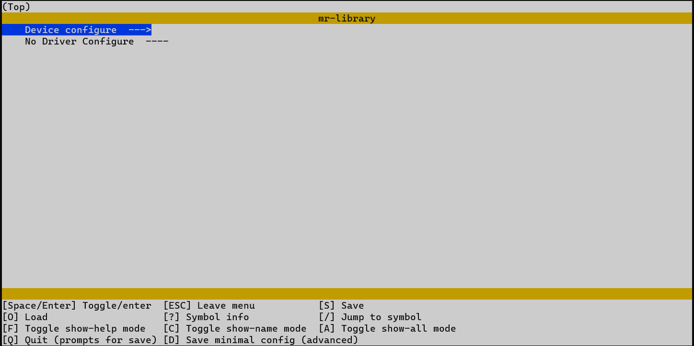

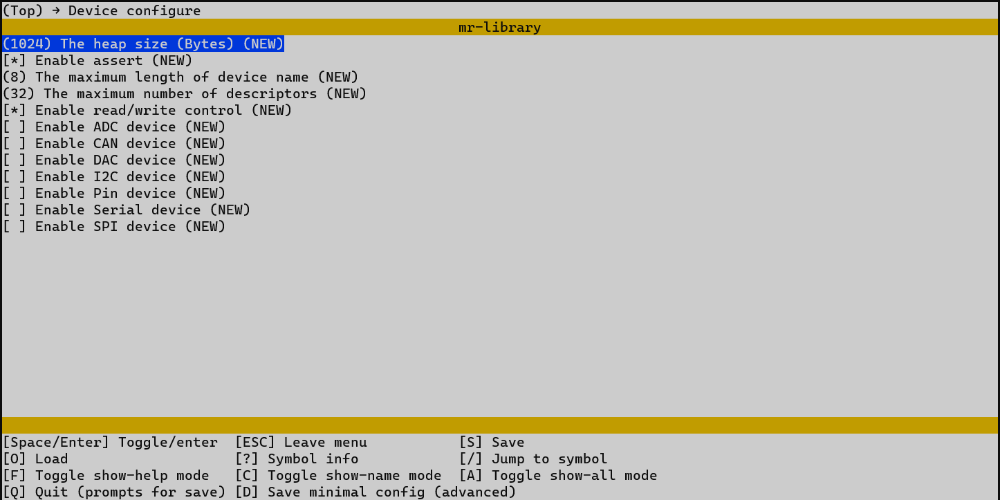

通过修改参数，快速裁剪所需功能。配置完成后通过 `Python` 脚本自动生成配置文件。

 ----------

# 目录结构

| 名称         | 描述     |
|:-----------|:-------|
| bsp        | 板级支持包  |
| components | 组件     |
| device     | 设备文件   |
| document   | 文档     |
| driver     | 驱动文件   |
| include    | 库头文件   |
| source     | 库源文件   |
| Kconfig    | 配置文件   |
| kconfig.py | 自动配置脚本 |
| LICENSE    | 许可证    |

 ----------

# 设备/组件支持一览表

| 设备/组件      | 计划  | 预览  | 稳定  | 文档  |
|:-----------|:----|:----|:----|:----|
| `ADC`      |     |     | [√] | [√] |
| `CAN`      |     | [√] |     |     |
| `DAC`      |     |     | [√] | [√] |
| `I2C`      |     |     | [√] | [√] |
| `Soft-I2C` |     |     | [√] | [√] |
| `Pin`      |     |     | [√] | [√] |
| `PWM`      | [√] |     |     |     |
| `Serial`   |     |     | [√] | [√] |
| `SPI`      |     |     | [√] | [√] |
| `Timer`    |     |     | [√] | [√] |
| `LCD`      | [√] |     |     |     |
| `Senser`   | [√] |     |     |     |

 ----------

# 开始使用

## 配置 `Kconfig` 环境

注：`Kconfig` 并非必须的，但是推荐使用（安装和配置非常快捷，后续教程也是以应用 `Kconfig` 为例）。

1. 验证系统是否安装Python环境。在命令行中运行 `python --version` 检查Python版本（`Kconfig` 依赖于 ` python`，若无 ` python`
   环境请自行安装）。

2. 在命令行中使用所示命令安装 `Kconfig`：

    ```cmd
    python -m pip install windows-curses
    python -m pip install kconfiglib
    ```

3. 在命令行中运行 `menuconfig -h` 验证安装是否成功。

## 将框架导入工程

1. 从 `Gitee` 或 `Github` 仓库下载最新版本源码到本地。
2. 将源码导入到您工程所在的目录。以STM32工程为例：

   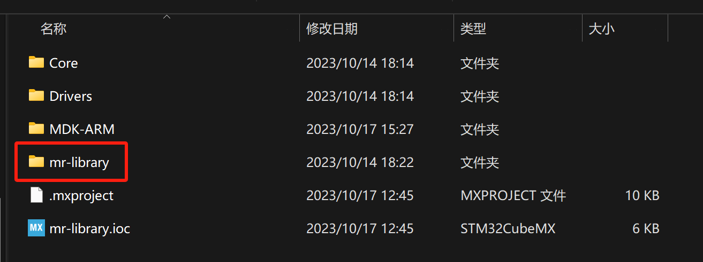

3. 如使用的芯片已经做了 `BSP` 适配请参考芯片对应 `BSP` 中的配置教程，完成 `BSP` 配置。
4. 移除不需要的文件 `bsp`、`document`、`module` 目录（如不需要`GIT`也可以移除`.git`文件删除）。完成后，目录结构如下所示：

   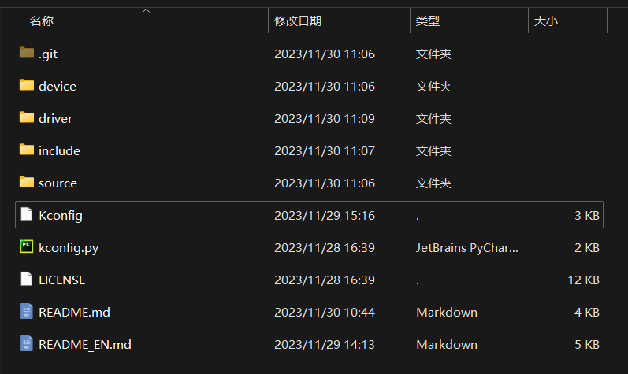

5. 将文件加入到IDE中（大部分IDE都能自动识别工程路径下的文件，无需进行此步骤）。以 `keil` 为例:

    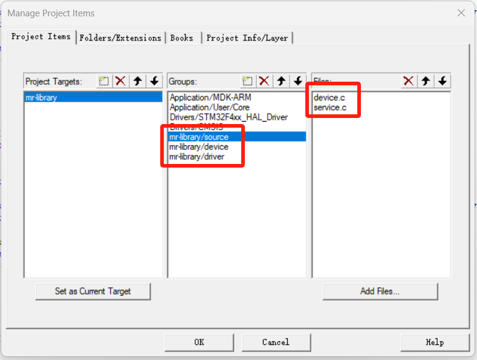

    添加 `source`、`device`、`driver` 目录下的所有文件。

## 配置菜单选项

1. 在 `mr-library` 目录下打开命令行工具，运行 `menuconfig` 进行菜单配置。

   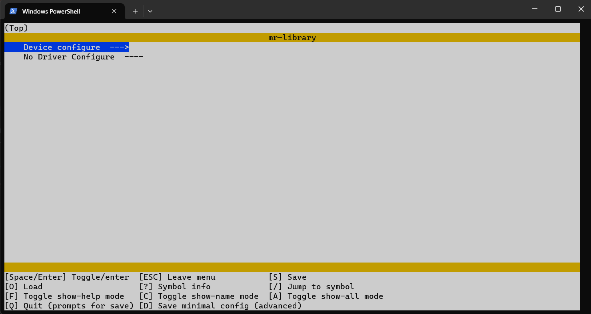

   注：当添加对应芯片驱动的后，将显示 `Device configure` 和 `Driver configure`。对应 `Driver configure` 请参考 `BSP` 下教程。

2. 选中 `Device configure` 回车进入菜单，按照需要配置功能。

   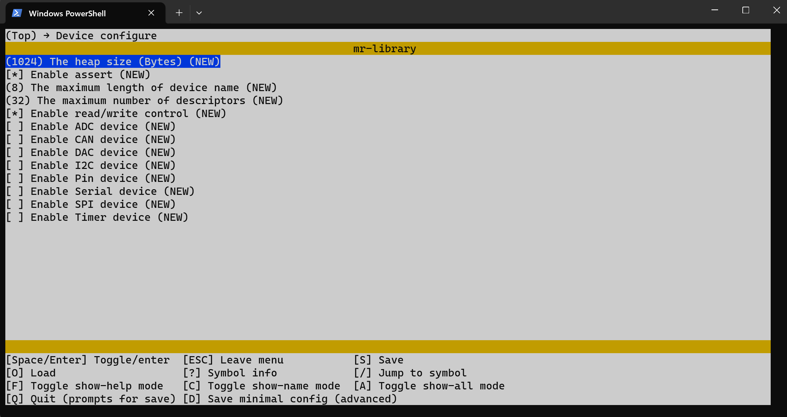

3. 配置完成后，按 `Q` 退出菜单配置界面，按`Y` 保存配置。

## 生成配置文件

1. 在 `mr-library` 目录下打开命令行工具，运行 `python kconfig.py`，自动生成配置文件 `mr_config.h`。

## 添加包含路径

1. 在编译器中添加 `mr-library` 的包含路径，以 `keil` 为例:

   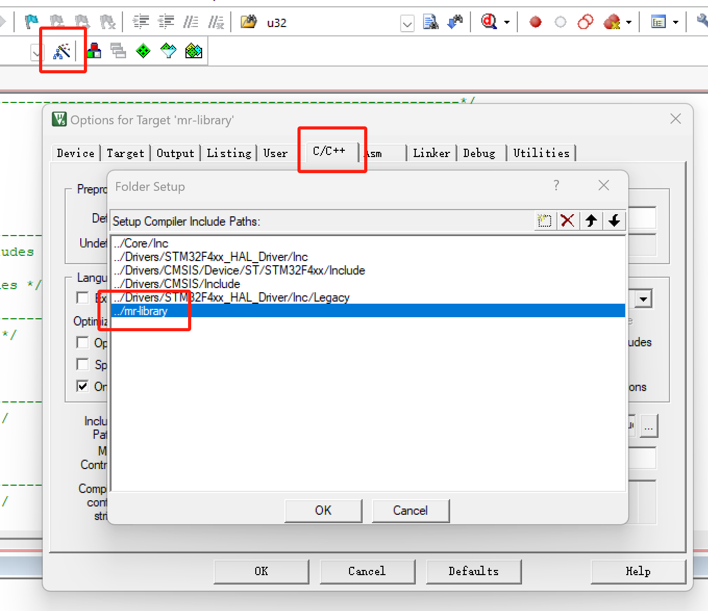

2. 配置自动初始化（GCC环境），查找您工程下以 `.ld` 为后缀的连接脚本文件（通常为 `link.ld`），在脚本文件中添加代码：
   注：如果您的是在 `keil` 等，能够自动生成链接脚本的环境下，请跳过此步骤。

   ```c
   /* mr-library auto init */
   . = ALIGN(4);
   _mr_auto_init_start = .;
   KEEP(*(SORT(.auto_init*)))
   _mr_auto_init_end = .;
   ```

   示例：

   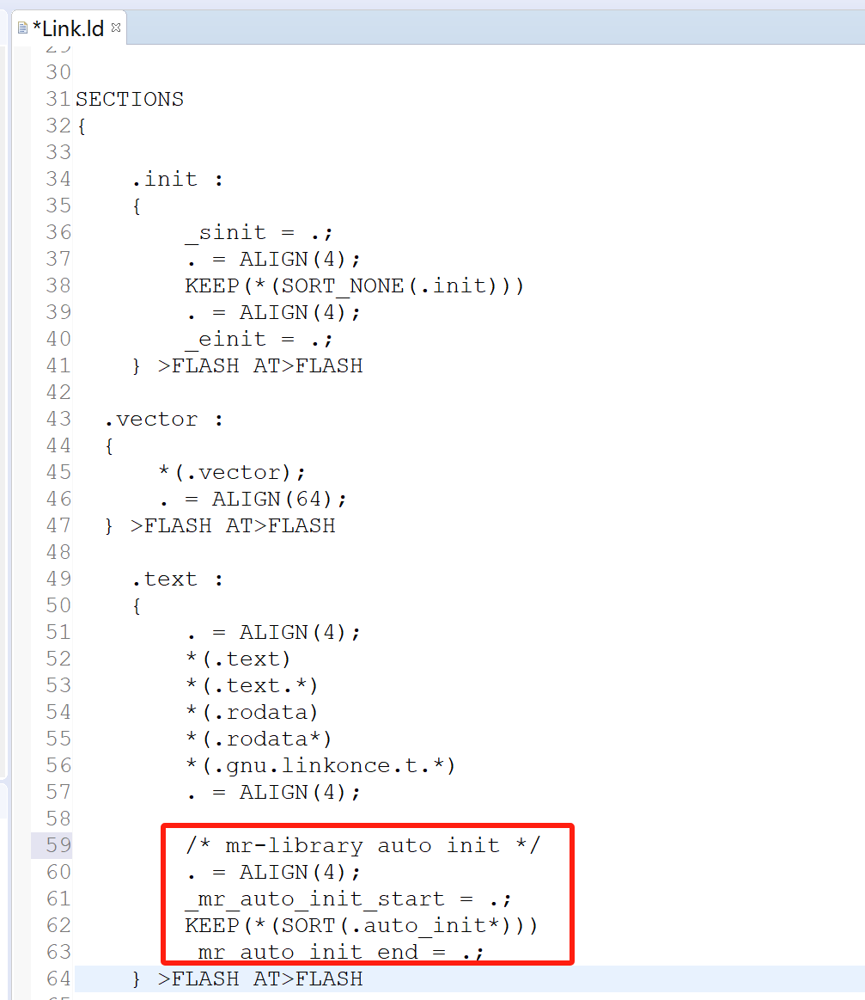

3. 配置GNU语法。如果您使用的是非 `GCC` 编译器，请使能GNU语法。以 `keil` 为例:

    AC5:

   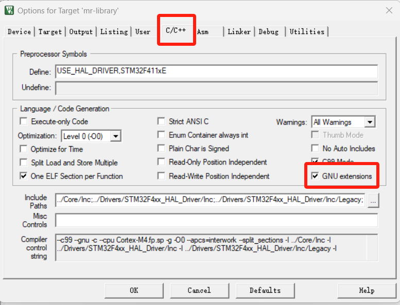

    AC6:

   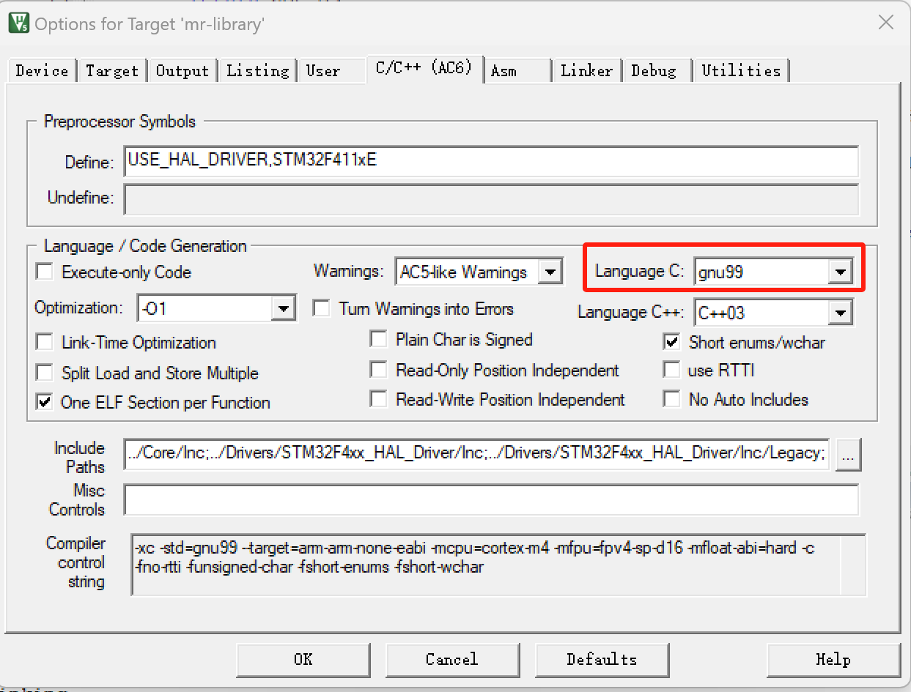

4. 在您的工程中引入 `#include "include/mr_lib.h"`。
5. 在 `main` 函数中添加 `mr_auto_init();` 自动初始化函数。

 ----------

# 先来点个灯吧

```c
#include "include/mr_lib.h"

/* 定义LED引脚（PC13）*/
#define LED_PIN_NUMBER                  45

int main(void)
{
    /* 自动初始化 */
    mr_auto_init();

    /* 打开PIN设备 */
    int ds = mr_dev_open("pin", MR_OFLAG_RDWR);
    /* 设置到LED引脚 */
    mr_dev_ioctl(ds, MR_CTL_PIN_SET_NUMBER, mr_make_local(int, LED_PIN_NUMBER));
    /* 设置LED引脚为推挽输出模式 */
    mr_dev_ioctl(ds, MR_CTL_PIN_SET_MODE, mr_make_local(int, MR_PIN_MODE_OUTPUT));

    while(1)
    {
        /* 点亮LED */
        mr_dev_write(ds, mr_make_local(uint8_t, MR_PIN_HIGH_LEVEL), sizeof(uint8_t));
        mr_delay_ms(500);
        mr_dev_write(ds, mr_make_local(uint8_t, MR_PIN_LOW_LEVEL), sizeof(uint8_t));
        mr_delay_ms(500);
    }
}
```

# Hello World

```c
#include "include/mr_lib.h"

int main(void)
{
    /* 自动初始化 */
    mr_auto_init();

    /* 打开Serial-1设备 */
    int ds = mr_dev_open("serial1", MR_OFLAG_RDWR);
    /* 输出Hello World */
    mr_dev_write(ds, "Hello World\r\n", sizeof("Hello World\r\n"));
    
    while(1);
}
```

 ----------

# 现在您已经完成了入门教程，开始使用MR库吧

1. [参考更多教程](document)。
2. 尝试基于某款芯片开发驱动，练习设备驱动编程。
3. 尝试编写更多设备模板和开发更多功能。
4. 欢迎您提出意见和建议。如果您对开发有兴趣，诚邀您参与到 `MR` 项目的开发中来，项目交流群：199915649（QQ）。
