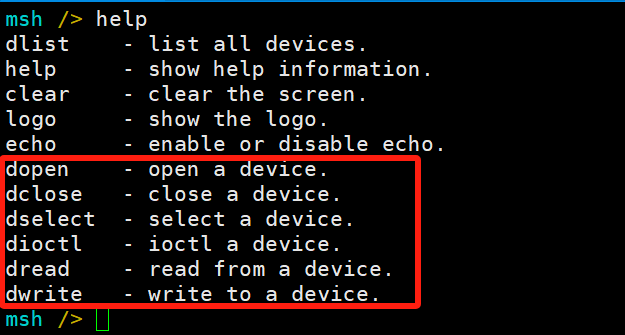
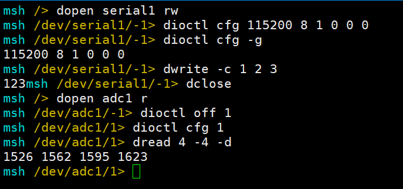
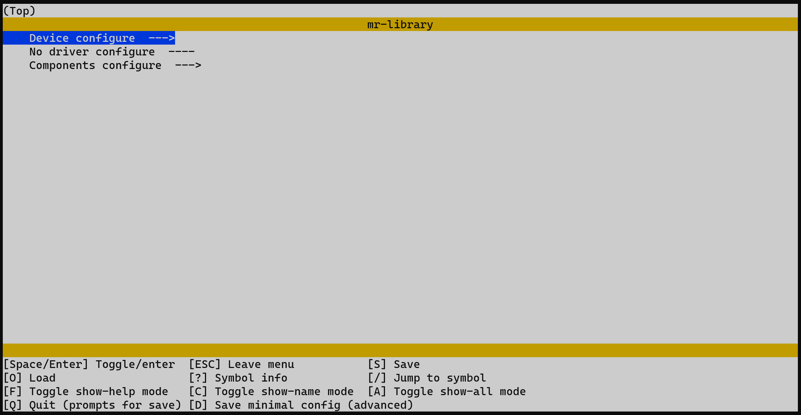
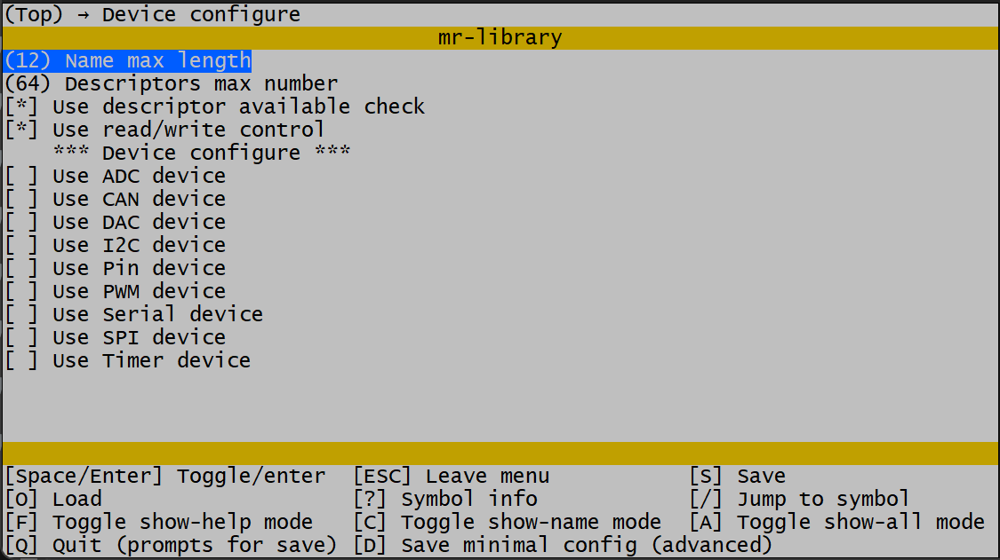
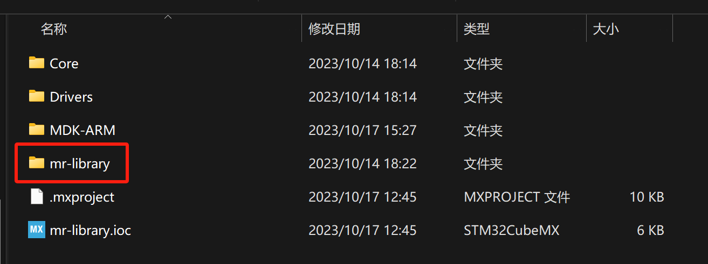
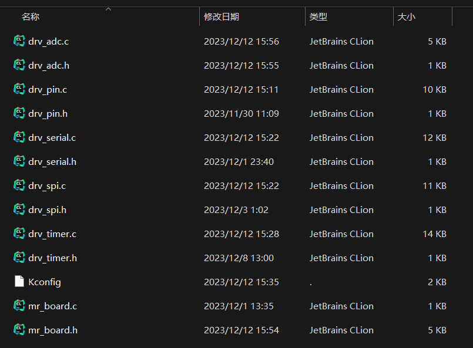
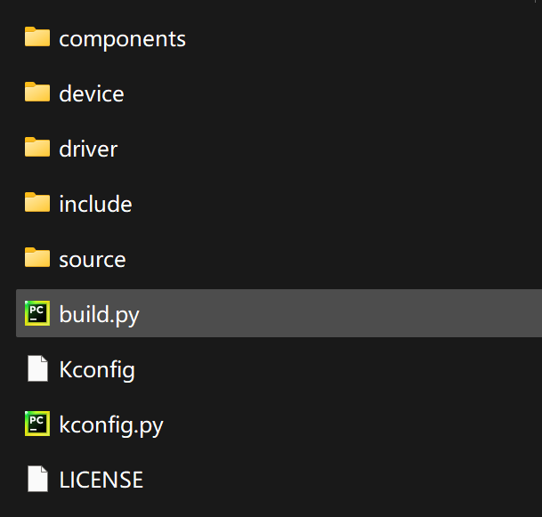
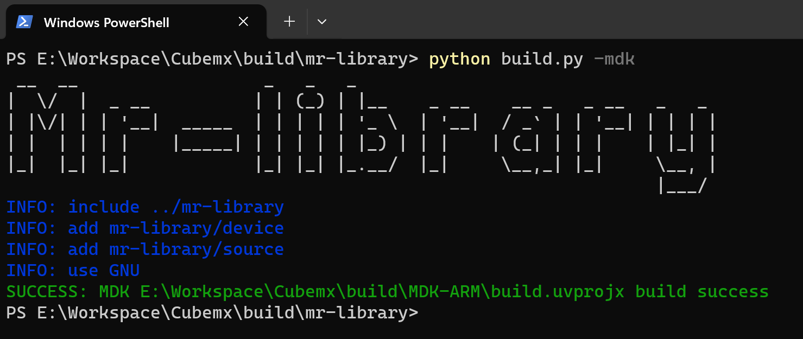
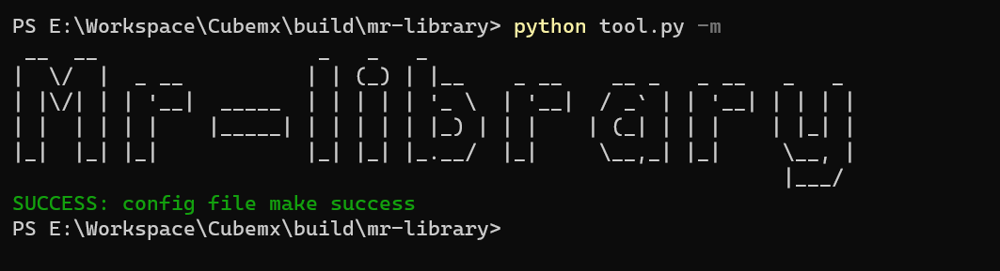

# MR frame

[中文](README.md)

 ----------

<!-- TOC -->
* [MR frame](#mr-frame)
* [Brief introduction](#brief-introduction)
* [Key characteristic](#key-characteristic)
* [Major component](#major-component)
* [Standardized device interface](#standardized-device-interface)
* [Configuration tool](#configuration-tool)
* [Directory structure](#directory-structure)
* [Device/Component Support Overview](#devicecomponent-support-overview)
* [Get Started](#get-started)
  * [Verifying Python environment](#verifying-python-environment)
  * [Import the project into the workspace](#import-the-project-into-the-workspace)
  * [Configure Menu Options](#configure-menu-options)
* [Let`s Light an LED](#lets-light-an-led)
* [Hello World](#hello-world)
* [Now that you have completed the introductory tutorial, start using the MR Library.](#now-that-you-have-completed-the-introductory-tutorial-start-using-the-mr-library)
<!-- TOC -->

 ----------

# Brief introduction

The `MR` framework is a lightweight framework designed specifically for embedded systems. It fully considers the
resource and performance requirements of embedded systems.

By providing standardized device management interfaces, it greatly simplifies the development of embedded applications
and helps developers quickly build embedded applications.

The framework provides developers with standardized `open`, `close`, `ioctl`, `read`, `write` and other
interfaces. It decouples the applications from the low-level hardware drivers. The applications do not need to know the
implementation details of the drivers.

When the hardware changes, the applications can seamlessly migrate to the new hardware by only adapting the low-level
drivers. This greatly improves the reusability of software and its extensibility to new hardware.

 ----------


 ----------

# Key characteristic

- Standardized device access interfaces
- Decoupled application and driver development
- Simplified lower-level driver and application development
- Lightweight and easy to use with low resource usage
- Modular design with loose coupling between components for independent development and extremely low hardware migration
  costs
- Supported in bare-metal and operating system environments

# Major component

- Device framework: Provides standardized device access interfaces
- Memory management: Dynamic memory management
- Tools: Common data structures like lists, queues, balanced trees etc.
- Various functional components

 ----------

# Standardized device interface

All operations of the device can be implemented through the following interfaces:

| interface       | describe                  |
|:----------------|:--------------------------|
| mr_dev_register | Registered device         |
| mr_dev_open     | Open device               |
| mr_dev_close    | Close device              |
| mr_dev_ioctl    | Control device            |
| mr_dev_read     | Read data from the device |
| mr_dev_write    | Writes data to the device |

Example:

```c
int main(void)
{
    /* Open SPI10 device under SPI1 bus line */
    int ds = mr_dev_open("spi1/spi10", MR_O_RDWR);
    
    /* Send data */
    uint8_t wr_buf[] = {0x01, 0x02, 0x03, 0x04};
    mr_dev_write(ds, wr_buf, sizeof(wr_buf));
    
    /* Receive data */
    uint8_t rd_buf[4] = {0};
    mr_dev_read(ds, rd_buf, sizeof(rd_buf));
    
    /* Close device */
    mr_dev_close(ds);
}
```

Thanks to the standardized device interface, all devices automatically support the `msh` device command, 
and all device operations can be completed through the command line.





 ----------

# Configuration tool

`MR` provides `Kconfig` visual configuration tool that developers can configure without deep knowledge of the source
code.

`Kconfig` will automatically generate the configuration options interface based on the configuration file. Developers
can select the functional components that need to be enabled and set relevant parameters through simple operations.





By modifying parameters, you can quickly tailor the required functions. After the configuration is complete,
the `Python` script automatically generates the configuration file.

 ----------

# Directory structure

| name       | describe                       |
|:-----------|:-------------------------------|
| bsp        | Board support package          |
| components | Components                     |
| device     | Device file                    |
| document   | Document                       |
| driver     | Driver file                    |
| include    | Library header file            |
| source     | Library source file            |
| Kconfig    | Configuration files            |
| LICENSE    | Open-source license            |
| kconfig.py | Automatic configuration script |
| tool.py    | Automatic build script         |

 ----------

# Device/Component Support Overview

| Device/Component | Plan | Preview | Stable | Document |
|:-----------------|:-----|:--------|:-------|:---------|
| `ADC`            |      |         | [√]    | [√]      |
| `CAN`            |      | [√]     |        |          |
| `DAC`            |      |         | [√]    | [√]      |
| `I2C`            |      |         | [√]    | [√]      |
| `Soft-I2C`       |      |         | [√]    | [√]      |
| `Pin`            |      |         | [√]    | [√]      |
| `PWM`            |      |         | [√]    | [√]      |
| `Serial`         |      |         | [√]    | [√]      |
| `SPI`            |      |         | [√]    | [√]      |
| `Timer`          |      |         | [√]    | [√]      |
| `msh`            |      |         | [√]    | [√]      |
| `LCD`            | [√]  |         |        |          |
| `Senser`         | [√]  |         |        |          |

 ----------

# Get Started

## Verifying Python environment

Verify that the Python environment is installed. Run `python --version` on the command line to check the Python
version (the `MR` scripting tool relies on Python, install it yourself if there is no Python environment, 
Versions later than `3.11.7` are not supported).

## Import the project into the workspace

1. Download the latest version source code from the `Gitee` or `GitHub` repository to the local.
2. Copy the source code to the directory where your project is located. Take the `MDK` project (CubeMX-generated
   standard project) as an example:

   

3. Copy the driver of the corresponding chip in the `bsp` directory to `driver`
   (Please read the documentation in `bsp` carefully):

   

4. Remove unnecessary files`bsp`, `document`directories (you can also remove `.git `files if you don't
   need`git`). When complete, the directory structure looks like this:

   

5. Use the automatic build script to complete the automatic build. In the `mr-library` path, open the command line tool and run `python tool.py -b`

   Take `MDK` as an example:

   

   Note:
   - Supports `MDK5` and `Eclipse`.
   - `MDK` uncompiled or too low a version can cause the 'GNU' configuration to fail.

## Configure Menu Options

1. Open the command line tool in the `mr-library` directory and run `python tool.py -m` for menu configuration.

   

   Run failed:
   - Check the `Python` version (versions above `3.11.7` are not currently supported, reinstall and remove the installed modules).
   - Command line tools are not supported, recommended to use `powershell(win10 and above)`, `git bash(newer version)` and so on.

2. Enter the menu by pressing the Enter key on `Device configure`, and configure the desired functions according to
   needs.

   

3. After configuration is complete, press `Q` to exit the menu configuration interface, press `Y` to save the
   configuration.

   

4. In the project, introduce `#include include/mr_lib.h`and add`mr_auto_init()`to`main`function;
   Automatically initialize the function and start using it.

Note: More commands can be entered: `python tool.py -h` to view.

 ----------

# Let`s Light an LED

```c
#include "include/mr_lib.h"

/* Define the LED pin-number (PC13) */
#define LED_PIN_NUMBER                  45

int main(void)
{
    /* Automatic initialization */
    mr_auto_init();

    /* Open the PIN device */
    int ds = mr_dev_open("pin", MR_O_WRONLY);
    /* Set to the LED pin */
    mr_dev_ioctl(ds, MR_IOC_PIN_SET_NUMBER, MR_MAKE_LOCAL(int, LED_PIN_NUMBER));
    /* Set the LED pin to push-pull output mode */
    mr_dev_ioctl(ds, MR_IOC_PIN_SET_MODE, MR_MAKE_LOCAL(int, MR_PIN_MODE_OUTPUT));

    while(1)
    {
        /* Light up the LED */
        mr_dev_write(ds, MR_MAKE_LOCAL(uint8_t, 1), sizeof(uint8_t));
        mr_delay_ms(500);
        mr_dev_write(ds, MR_MAKE_LOCAL(uint8_t, 0), sizeof(uint8_t));
        mr_delay_ms(500);
    }
}
```

# Hello World

```c
#include "include/mr_lib.h"

int main(void)
{
    /* Automatic initialization */
    mr_auto_init();

    /* Open the Serial-1 device */
    int ds = mr_dev_open("serial1", MR_O_RDWR);
    /* Output Hello World */
    mr_dev_write(ds, "Hello World\r\n", sizeof("Hello World\r\n"));
    
    while(1);
}
```

 ----------

# Now that you have completed the introductory tutorial, start using the MR Library.

1. [See more tutorials](document).
2. Try developing drivers based on certain chips to practice device driver programming.
3. Try writing more device templates and developing more features.
4. Welcome to provide your opinions and suggestions. If you are interested in development, you are welcome to
   participate in the development of the `MR` project. The project discussion group is: 199915649(QQ).
