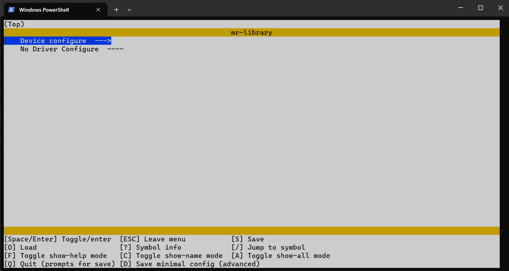

# MR frame

[中文](README.md)

 ----------

<!-- TOC -->
* [MR frame](#mr-frame)
* [Brief introduction](#brief-introduction)
* [Key characteristic](#key-characteristic)
* [Major component](#major-component)
* [Standardized device interface](#standardized-device-interface)
* [Configuration tool](#configuration-tool)
* [Directory structure](#directory-structure)
* [Device/Component Support Overview](#devicecomponent-support-overview)
* [Get Started](#get-started)
  * [Configure the Kconfig Environment](#configure-the-kconfig-environment)
  * [Import the Framework into the Project](#import-the-framework-into-the-project)
  * [Configure Menu Options](#configure-menu-options)
  * [Generate Configuration File](#generate-configuration-file)
  * [Add Include Paths](#add-include-paths)
* [Let's Light an LED](#lets-light-an-led)
* [Hello World](#hello-world)
* [Now that you have completed the introductory tutorial, start using the MR Library.](#now-that-you-have-completed-the-introductory-tutorial-start-using-the-mr-library)
<!-- TOC -->

 ----------

# Brief introduction

The `MR` framework is a lightweight framework designed specifically for embedded systems. It fully considers the
resource and performance requirements of embedded systems.

By providing standardized device management interfaces, it greatly simplifies the development of embedded applications
and helps developers quickly build embedded applications.

The framework provides developers with standardized `open`, `close`, `ioctl`, `read`, `write` and other
interfaces. It decouples the applications from the low-level hardware drivers. The applications do not need to know the
implementation details of the drivers.

When the hardware changes, the applications can seamlessly migrate to the new hardware by only adapting the low-level
drivers. This greatly improves the reusability of software and its extensibility to new hardware.

 ----------


 ----------

# Key characteristic

- Standardized device access interfaces
- Decoupled application and driver development
- Simplified lower-level driver and application development
- Lightweight and easy to use with low resource usage
- Modular design with loose coupling between components for independent development and extremely low hardware migration
  costs
- Supported in bare-metal and operating system environments

# Major component

- Device framework: Provides standardized device access interfaces
- Memory management: Dynamic memory management
- Tools: Common data structures like lists, queues, balanced trees etc.
- Various functional components

 ----------

# Standardized device interface

All operations of the device can be implemented through the following interfaces:

| interface       | describe                  |
|:----------------|:--------------------------|
| mr_dev_register | Registered device         |
| mr_dev_open     | Open device               |
| mr_dev_close    | Close device              |
| mr_dev_ioctl    | Control device            |
| mr_dev_read     | Read data from the device |
| mr_dev_write    | Writes data to the device |

Example:

```c
struct mr_spi_dev spi_dev;

int main(void)
{
    /* Register SPI10 device (CS low active) to SPI1 bus */
    mr_spi_dev_register(&spi_dev, "spi1/spi10", 0, MR_SPI_CS_ACTIVE_LOW);

    /* Open SPI10 device under SPI1 bus line */
    int ds = mr_dev_open("spi1/spi10", MR_OFLAG_RDWR);
    
    /* Send data */
    uint8_t wr_buf[] = {0x01, 0x02, 0x03, 0x04};
    mr_dev_write(ds, wr_buf, sizeof(wr_buf));
    
    /* Receive data */
    uint8_t rd_buf[4] = {0};
    mr_dev_read(ds, rd_buf, sizeof(rd_buf));
    
    /* Close device */
    mr_dev_close(ds);
}
```

 ----------

# Configuration tool

`MR` provides `Kconfig` visual configuration tool that developers can configure without deep knowledge of the source
code.

`Kconfig` will automatically generate the configuration options interface based on the configuration file. Developers
can select the functional components that need to be enabled and set relevant parameters through simple operations.


By modifying parameters, you can quickly tailor the required functions. After the configuration is complete,
the `Python` script automatically generates the configuration file.

 ----------

# Directory structure

| name       | describe                       |
|:-----------|:-------------------------------|
| bsp        | Board support package          |
| components | Components                     |
| device     | Device file                    |
| document   | Document                       |
| driver     | Driver file                    |
| include    | Library header file            |
| source     | Library source file            |
| Kconfig    | Configuration files            |
| kconfig.py | Automatic configuration script |
| LICENSE    | Open-source license            |

 ----------

# Device/Component Support Overview

| Device/Component | Plan | Preview | Stable | Document |
|:-----------------|:-----|:--------|:-------|:---------|
| `ADC`            |      |         | [√]    | [√]      |
| `CAN`            |      | [√]     |        |          |
| `DAC`            |      |         | [√]    | [√]      |
| `I2C`            |      |         | [√]    | [√]      |
| `Soft-I2C`       |      |         | [√]    | [√]      |
| `Pin`            |      |         | [√]    | [√]      |
| `PWM`            | [√]  |         |        |          |
| `Serial`         |      |         | [√]    | [√]      |
| `SPI`            |      |         | [√]    | [√]      |
| `Timer`          |      |         | [√]    | [√]      |
| `LCD`            | [√]  |         |        |          |
| `Senser`         | [√]  |         |        |          |

 ----------

# Get Started

## Configure the Kconfig Environment

Note: Kconfig is not mandatory, but recommended (installation and configuration are very quick, and the following
tutorials are based on applying Kconfig).

1. Verify that the system has a Python environment installed. Run `python --version` in the command line to check the
   Python version (Kconfig depends on python, please install python if it is not available).

2. Use the following commands to install Kconfig in the command line:

    ```cmd
    python -m pip install windows-curses
    python -m pip install kconfiglib
    ```

3. Run `menuconfig -h` in the command line to verify successful installation.

## Import the Framework into the Project

1. Download the latest version source code from the Gitee or Github repository to the local.
2. Import the source code into the directory where your project is located. Taking an STM32 project as an example:

   

3. If the used chip has BSP adaptation, please refer to the chip's corresponding BSP configuration tutorial to complete
   the BSP configuration.
4. Remove unnecessary files such as `bsp`、`document`、`module` directories (you can also remove the `.git` file to delete
   GIT if not needed). The directory structure is shown below after completion:

   

5. Add the files to the IDE (most ides automatically recognize the files in the project path, eliminating the need for
   this step). Take `keil` for example:

   

   Add all files in the `source`, `device`, `driver` directories.

## Configure Menu Options

1. Open the command line tool in the `mr-library` directory and run `menuconfig` to configure the menu.

   

   Note: When the corresponding chip driver is added, `Device configure` and `Driver configure` will be displayed.
   Please refer to the tutorial under `BSP` for `Driver configure`.

2. Enter the menu by pressing the Enter key on `Device configure`, and configure the desired functions according to
   needs.

   

3. After configuration is complete, press `Q` to exit the menu configuration interface, press `Y` to save the
   configuration.

## Generate Configuration File

1. Run `python kconfig.py` in the command line tool under `mr-library` directory to automatically generate the
   configuration file `mr_config.h`.

## Add Include Paths

1. Add the include paths of `mr-library` in the compiler, taking `keil` as an example:

   

2. Configure automatic initialization (GCC environment), find the link script file with suffix `.ld` in your project
   directory (usually `link.ld`), and add the following code to the script file:

   ```c
   /* mr-library auto init */
   . = ALIGN(4);
   _mr_auto_init_start = .;
   KEEP(*(SORT(.auto_init*)))
   _mr_auto_init_end = .;
   ```

   Example:

   

3. Configure the GNU syntax. If you are using a non-gcc compiler, enable GNU syntax. Take `keil` for example:

   AC5:

   

   AC6:

   

4. Include `#include "include/mr_lib.h"` in your project.
5. Add the automatic initialization function `mr_auto_init();` in the main function.

 ----------

# Let's Light an LED

```c
#include "include/mr_lib.h"

/* Define the LED pin-number (PC13) */
#define LED_PIN_NUMBER                  45

int main(void)
{
    /* Automatic initialization */
    mr_auto_init();

    /* Open the PIN device */
    int ds = mr_dev_open("pin", MR_OFLAG_RDWR);
    /* Set to the LED pin */
    mr_dev_ioctl(ds, MR_CTL_PIN_SET_NUMBER, mr_make_local(int, LED_PIN_NUMBER));
    /* Set the LED pin to push-pull output mode */
    mr_dev_ioctl(ds, MR_CTL_PIN_SET_MODE, mr_make_local(int, MR_PIN_MODE_OUTPUT));

    while(1)
    {
        /* Light up the LED */
        mr_dev_write(ds, mr_make_local(uint8_t, MR_PIN_HIGH_LEVEL), sizeof(uint8_t));
        mr_delay_ms(500);
        mr_dev_write(ds, mr_make_local(uint8_t, MR_PIN_LOW_LEVEL), sizeof(uint8_t));
        mr_delay_ms(500);
    }
}
```

# Hello World

```c
#include "include/mr_lib.h"

int main(void)
{
    /* Automatic initialization */
    mr_auto_init();

    /* Open the Serial-1 device */
    int ds = mr_dev_open("serial1", MR_OFLAG_RDWR);
    /* Output Hello World */
    mr_dev_write(ds, "Hello World\r\n", sizeof("Hello World\r\n"));
    
    while(1);
}
```

 ----------

# Now that you have completed the introductory tutorial, start using the MR Library.

1. [See more tutorials](document).
2. Try developing drivers based on certain chips to practice device driver programming.
3. Try writing more device templates and developing more features.
4. Welcome to provide your opinions and suggestions. If you are interested in development, you are welcome to
   participate in the development of the `MR` project. The project discussion group is: 199915649(QQ).
