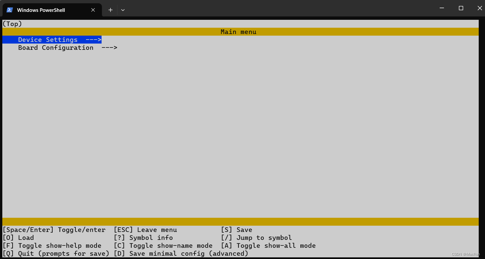
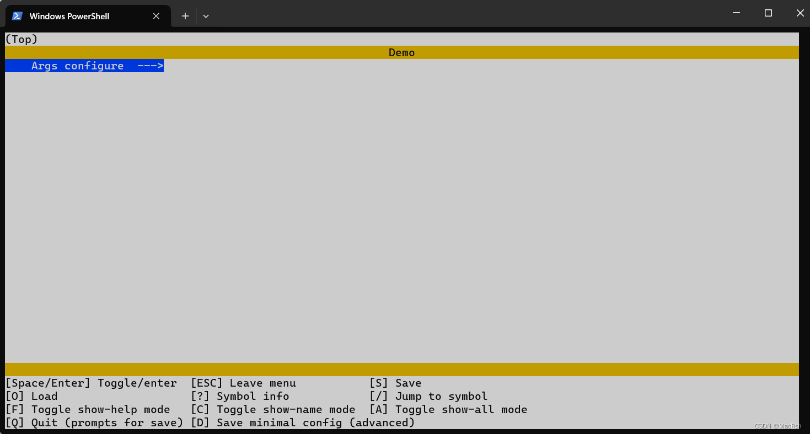
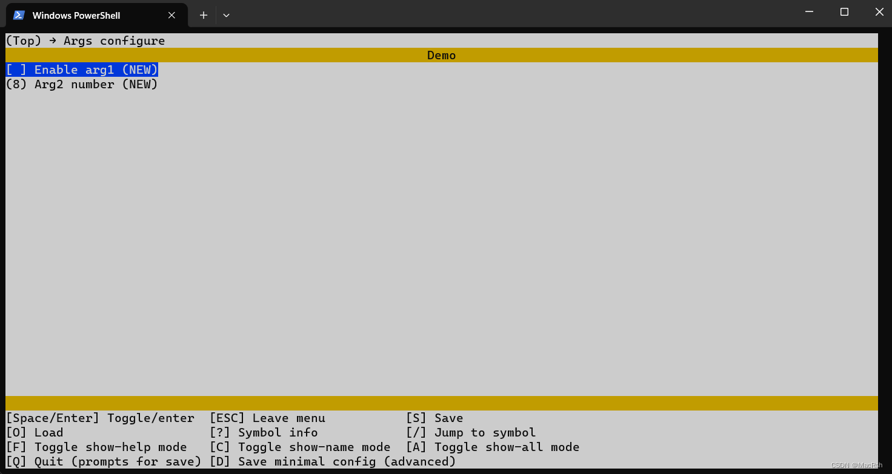
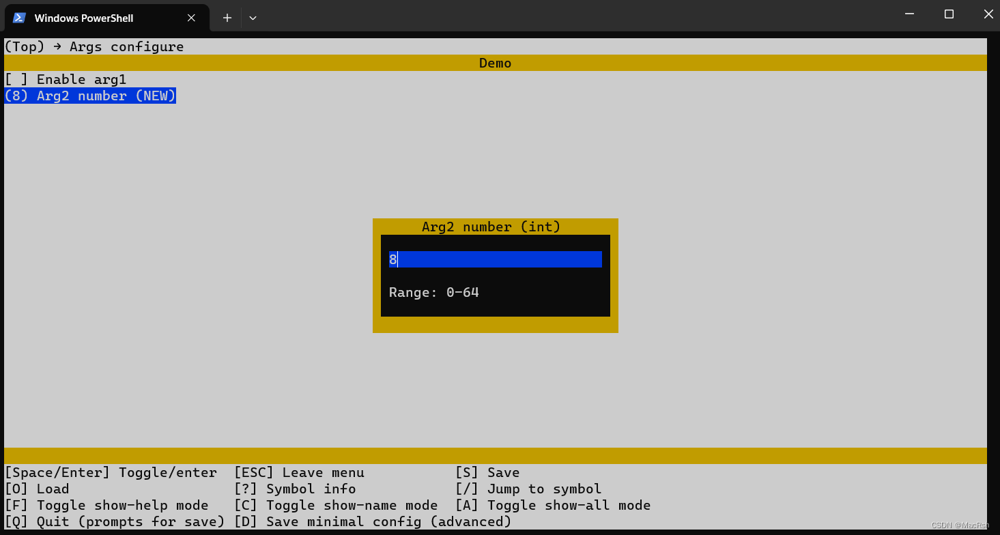
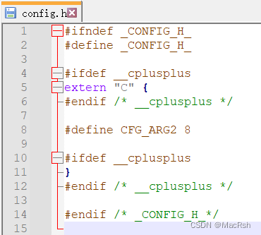

# How to introduce the Kconfig configuration system into a project

[中文](introduce_Kconfig.md)

<!-- TOC -->
* [How to introduce the Kconfig configuration system into a project](#how-to-introduce-the-kconfig-configuration-system-into-a-project)
  * [Verify Python Environment](#verify-python-environment)
  * [C Header File Generation Script](#c-header-file-generation-script)
* [Application](#application)
  * [Create Kconfig](#create-kconfig)
<!-- TOC -->

There are often macro configurations or parameter selections in projects:

```c
#ifdef CFG_ENABLE
#define CFG_ARGS    "test" 
void printf_args(void)
{
    printf("args: %s\n", CFG_ARGS);
}
#endif
```

When the project scale is relatively small and the dependency relationships are relatively simple, we can manually
modify the source code to implement configuration functions. However, as the project scale increases and configuration
complexity increases, this approach will also have some problems.

As the code volume and call relations increase, it becomes `difficult` for configurers to fully understand
the `code structure` and dependencies between modules. At the same time, if the configuration items are set in
a `casual` and `lack of constraints` manner, it is also very likely to lead to `incorrect configuration`. This brings
certain difficulties to project quality and maintenance.

For large-scale projects, a professional configuration management system is needed to solve these problems. Kconfig is
designed to address this need. It defines various configuration options and their dependencies through configuration
scripts, and provides a `graphical interface` for configurers to operate. It also checks the `rationality` of
configurations to help us achieve customized builds while `preventing incorrect configurations`.

If you have experience with the Linux or RT-Thread, Kconfig system should not be unfamiliar. Kconfig is a widely used
configuration management tool in Linux kernel and many other systems. It allows
developers to selectively include or exclude some functional modules during compilation.

Kconfig uses configuration scripts to define various configuration options and their dependencies. Through graphical or
character-based user interfaces, developers can view and set various configurations. Then Kconfig will generate
a `.config` file to save the selection results. During compilation, it will automatically include or exclude the
corresponding source code according to the settings in the `.config` file.



## Verify Python Environment

Kconfig depends on `python`. If there is no `python` environment, please install it yourself.
Use the following command in the command line to verify:

```cmd
python --version
```

Display (Correctly displaying the version is okay):

```cmd
Python 3.11.4
```

## C Header File Generation Script

Kconfiglib generates a `.config` file instead of a C language file. A script is needed to generate header
files. `Copy the following code to a file and name it kconfig.py.`

```python
import re
import pip


def log_print(level, text):
    # Log level colors
    LEVEL_COLORS = {
        'error': '\033[31m',
        'success': '\033[32m',
        'warning': '\033[33m',
        'info': '\033[34m',
    }
    RESET_COLOR = '\033[0m'
    # Log level name
    LEVEL_NAME = {
        'error': 'ERROR',
        'success': 'SUCCESS',
        'warning': 'WARNING',
        'info': 'INFO',
    }
    print(LEVEL_COLORS[level] + LEVEL_NAME[level] + ': ' + text + RESET_COLOR)


def install_package(package):
    log_print('info', "%s package installing..." % package)
    pip.main(['install', package])


try:
    from kconfiglib import Kconfig
except ImportError:
    install_package('kconfiglib')
    from kconfiglib import Kconfig

try:
    import curses
except ImportError:
    install_package('windows-curses')
    import curses


def generate_config(kconfig_file, config_in, config_out, header_out):
    kconf = Kconfig(kconfig_file, warn=False, warn_to_stderr=False)

    # Load config
    kconf.load_config(config_in)
    kconf.write_config(config_out)
    kconf.write_autoconf(header_out)

    with open(header_out, 'r+') as header_file:
        content = header_file.read()
        header_file.truncate(0)
        header_file.seek(0)

        # Remove CONFIG_ and MR_USING_XXX following number
        content = content.replace("#define CONFIG_", "#define ")
        content = re.sub(r'#define MR_USING_(\w+) (\d+)', r'#define MR_USING_\1', content)

        # Add the micro
        header_file.write("#ifndef _MR_CONFIG_H_\n")
        header_file.write("#define _MR_CONFIG_H_\n\n")

        header_file.write("#ifdef __cplusplus\n")
        header_file.write("extern \"C\" {\n")
        header_file.write("#endif /* __cplusplus */\n\n")

        # Write back the original data
        header_file.write(content)

        # Add the micro
        header_file.write("\n#ifdef __cplusplus\n")
        header_file.write("}\n")
        header_file.write("#endif /* __cplusplus */\n\n")
        header_file.write("#endif /* _MR_CONFIG_H_ */\n")

        header_file.close()
        log_print('success', "menuconfig %s make success" % header_out)


def main():
    kconfig_file = ''
    config_in = '.config'
    config_out = '.config'
    header_out = 'config.h'
    generate_config(kconfig_file, config_in, config_out, header_out)


if __name__ == "__main__":
    main()
```

Modify `header_out` in the `main` function to modify the generated function file name.

This script removes the `CONFIG_` prefix added by Kconfig by default and adds `_CONFIG_H_` and `C` declarations to it.

# Application

## Create Kconfig

Create a new file named `Kconfig` (without extension), and put it together with the `kconfig.py` file created in the
previous step.

```Kconfig
mainmenu "Demo"

menu "Args configure"
config CFG_ARG1
    bool "Enable arg1"
    default n
    
config CFG_ARG2
	int "Arg2 number"
	default 8
	range 0 64

endmenu
```

Call menuconfig in the command line:

```cmd
menuconfig
```

Configure and generate header file.



Press enter, you can see the two parameters configured:



The range of Settings also takes effect when entering:



After the configuration is complete, press `Q` to exit and `Y` to save the configuration.

In the current directory, call up the command line and type:

```cmd
python kconfig.py
```

Run the `python` script to generate the `.h` file.

The `config.h` is successfully generated. Open this file:


